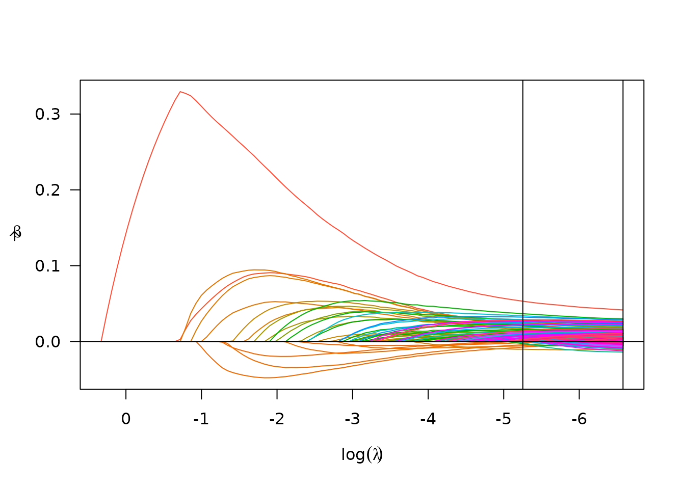

# Time Series Modeling with Multiple Modes

## The `uihc_ed_arrivals` data set

The University of Iowa Hospitals and Clinics (UIHC) Emergency Department
Arrivals data set is included as a component of this package, and
consists of 41,640 hourly counts of number of new arrivals into the ED
spanning the years 2013-2018. See the data set documentation,
[`?uihc_ed_arrivals`](https://petersonr.github.io/fastTS/reference/uihc_ed_arrivals.md),
for more information.

## Modeling the data

### Endogenous model (SRLPAC)

First we’ll load and summarize the data. Note that although we have
plenty of information on year, month, and day, the data set has already
been sorted by time.

``` r
data("uihc_ed_arrivals")
str(uihc_ed_arrivals)
#> 'data.frame':    41640 obs. of  17 variables:
#>  $ Year    : num  2013 2013 2013 2013 2013 ...
#>  $ Quarter : Factor w/ 4 levels "Q1","Q2","Q3",..: 1 1 1 1 1 1 1 1 1 1 ...
#>  $ Month   : num  7 7 7 7 7 7 7 7 7 7 ...
#>  $ Day     : num  1 1 1 1 1 1 1 1 1 1 ...
#>  $ Hour    : num  0 1 2 3 4 5 6 7 8 9 ...
#>  $ Arrivals: num  5 5 8 2 2 1 4 1 4 6 ...
#>  $ Date    : Date, format: "2013-07-01" "2013-07-01" ...
#>  $ Weekday : Ord.factor w/ 7 levels "Sun"<"Mon"<"Tue"<..: 2 2 2 2 2 2 2 2 2 2 ...
#>  $ temp    : num  57 57 57 56 56 57 59 60 60 61 ...
#>  $ xmas    : num  0 0 0 0 0 0 0 0 0 0 ...
#>  $ xmas2   : num  0 0 0 0 0 0 0 0 0 0 ...
#>  $ nye     : num  0 0 0 0 0 0 0 0 0 0 ...
#>  $ nyd     : num  0 0 0 0 0 0 0 0 0 0 ...
#>  $ thx     : num  0 0 0 0 0 0 0 0 0 0 ...
#>  $ thx1    : num  0 0 0 0 0 0 0 0 0 0 ...
#>  $ ind     : num  0 0 0 0 0 0 0 0 0 0 ...
#>  $ game_day: num  0 0 0 0 0 0 0 0 0 0 ...
```

Let’s pull out our outcome and look at it.

``` r
y <- uihc_ed_arrivals$Arrivals
plot(y, type = "l")
```


OK, not too helpful visually. Such is the trap of being so close to
asymptopia. Let’s look a bit closer at the partial autocorrelation
function to see what kind of seasonality and autoregressive (AR)
structure we could be dealing with.

``` r
# number of maximum lags to consider
n_lags_max <- 24*7*5 # consider 5 weeks' data lags
pacfs <- pacf(ts(y), lag.max = n_lags_max, plot = F)
plot(pacfs)
```


Clearly we have multiple modes of seasonality in this hourly data,
likely corresponding to observed shift-based, daily, and weekly
patterns. Thankfully the sparsity ranked lasso (SRL) time series fitting
procedure can handle this situation in stride.

We can fit an endogenous SRLPAC model using one line of code which might
take 1-2 minutes to run:

``` r
srlpac <- fastTS(y, n_lags_max = n_lags_max, ptrain = 0.9)
```

We can investigate the performance of the SRLPAC model using associated
`print`, `coef`, `summary`, and `plot` functions.

``` r
srlpac
#> An endogenous PACF-based fastTS model.
#> 
#>  PF_gamma   AICc_d    BIC_d
#>      0.00    73.99   292.98
#>      0.25    11.63    20.55
#>      0.50      *0*      *0*
#>      1.00   345.67    80.13
#>      2.00  2719.38  2139.19
#>      4.00  8347.84  7640.05
#>      8.00 15920.25 15152.91
#>     16.00 15920.25 15152.91
#> 
#> AICc_d and BIC_d are the difference from the minimum; *0* is best.
#> 
#> - Best AICc model: 167 active terms
#> - Best BIC  model: 68 active terms
#> 
#> Test-set prediction accuracy (10% held-out test set)
#>          rmse       rsq      mae
#> AICc 2.651049 0.5276457 2.050730
#> BIC  2.656269 0.5257839 2.057091
```

By default, `fastTS` used 8 possible tuning parameters for $\gamma$, the
penalty weight exponent, and using AICc as a judge it appears the best
value is 0.5. By default, the argument `p_train` is set to 0.8, which
means we also get prediction accuracy for a left-out 20% of the data,
and revealing an R-squared of 53.1%, meaning that about half of the
variance in hourly visits to the ED can be explained by multi-modal
seasonal and local autoregressive patterns.

The lasso’s solution path for these lags can be seen via the `plot`
function.

``` r
plot(srlpac)
```


To see the (long) list of selected coefficients, the `summary` function
can be used.

Expand to see output

``` r
summary(srlpac)
#> Model summary (ncvreg) at optimal AICc (lambda=0.0017; gamma=0.5)
#> lasso-penalized linear regression with n=36636, p=840
#> At lambda=0.0017:
#> -------------------------------------------------
#>   Nonzero coefficients         : 166
#>   Expected nonzero coefficients:  89.94
#>   Average mfdr (166 features)  :   0.542
#> 
#>          Estimate       z       mfdr Selected
#> lag1    4.832e-02 13.8334    < 1e-04        *
#> lag168  3.128e-02  9.3035    < 1e-04        *
#> lag336  2.913e-02  8.8062    < 1e-04        *
#> lag504  2.838e-02  8.7034    < 1e-04        *
#> lag840  2.611e-02  8.2193    < 1e-04        *
#> lag672  2.614e-02  8.1720    < 1e-04        *
#> lag337  2.578e-02  7.9079    < 1e-04        *
#> lag671  2.497e-02  7.8255    < 1e-04        *
#> lag503  2.419e-02  7.5314    < 1e-04        *
#> lag170  2.394e-02  7.3430    < 1e-04        *
#> lag167  2.374e-02  7.1869    < 1e-04        *
#> lag673  2.212e-02  7.0841    < 1e-04        *
#> lag47   2.285e-02  6.8408    < 1e-04        *
#> lag505  2.088e-02  6.6926    < 1e-04        *
#> lag335  2.142e-02  6.6878    < 1e-04        *
#> lag2    2.233e-02  6.5631    < 1e-04        *
#> lag72   2.081e-02  6.3162    < 1e-04        *
#> lag3    2.046e-02  6.2389    < 1e-04        *
#> lag96   2.016e-02  6.1570    < 1e-04        *
#> lag432  1.813e-02  5.9159    < 1e-04        *
#> lag73   1.816e-02  5.6173    < 1e-04        *
#> lag144  1.777e-02  5.5418    < 1e-04        *
#> lag839  1.594e-02  5.5196    < 1e-04        *
#> lag23   1.807e-02  5.4146    < 1e-04        *
#> lag169  1.695e-02  5.3612    < 1e-04        *
#> lag166  1.578e-02  5.0024 0.00013304        *
#> lag24   1.646e-02  4.9811 0.00014421        *
#> lag647  1.399e-02  4.8894 0.00020612        *
#> lag192  1.481e-02  4.8607 0.00023170        *
#> lag528  1.313e-02  4.7248 0.00041199        *
#> lag25   1.499e-02  4.6212 0.00064414        *
#> lag600  1.243e-02  4.4974 0.00109781        *
#> lag190  1.329e-02  4.4680 0.00124702        *
#> lag22   1.469e-02  4.4586 0.00129820        *
#> lag71   1.370e-02  4.3025 0.00250449        *
#> lag338  1.237e-02  4.2944 0.00258411        *
#> lag674  1.076e-02  4.0905 0.00507800        *
#> lag283 -1.279e-02 -4.4935 0.00550651        *
#> lag191  1.188e-02  4.0510 0.00566295        *
#> lag312  1.143e-02  3.9938 0.00662490        *
#> lag648  1.017e-02  3.9094 0.00847559        *
#> lag838  9.762e-03  3.8902 0.00900218        *
#> lag481  1.064e-02  3.8646 0.00978850        *
#> lag241  1.064e-02  3.7938 0.01257043        *
#> lag263  1.062e-02  3.7646 0.01404710        *
#> lag670  9.846e-03  3.7290 0.01619361        *
#> lag143  1.117e-02  3.7159 0.01710427        *
#> lag649  9.386e-03  3.6818 0.01973798        *
#> lag644 -1.142e-02 -4.1916 0.02004784        *
#> lag696  8.329e-03  3.6545 0.02218302        *
#> lag360  8.925e-03  3.4680 0.04644124        *
#> lag502  9.070e-03  3.4593 0.04782684        *
#> lag506  8.383e-03  3.4020 0.05656526        *
#> lag462 -9.032e-03 -3.5147 0.07544922        *
#> lag212 -8.826e-03 -3.4942 0.07740615        *
#> lag700 -8.677e-03 -3.4654 0.08102706        *
#> lag4    9.476e-03  3.2218 0.08513626        *
#> lag770  7.547e-03  3.1949 0.09050678        *
#> lag288  8.157e-03  3.1730 0.09545128        *
#> lag6    9.919e-03  3.1411 0.10355275        *
#> lag119  9.133e-03  3.1349 0.10529360        *
#> lag317 -8.195e-03 -3.3438 0.10827871        *
#> lag26   9.165e-03  3.0991 0.11650038        *
#> lag480  7.304e-03  3.0785 0.12392532        *
#> lag816  6.479e-03  3.0524 0.13488996        *
#> lag685 -6.883e-03 -3.2704 0.13679117        *
#> lag533 -7.910e-03 -3.2636 0.13999713        *
#> lag817  6.235e-03  3.0378 0.14150660        *
#> lag7    9.577e-03  3.0323 0.14425271        *
#> lag214  7.360e-03  2.9473 0.19878897        *
#> lag116 -7.533e-03 -3.1542 0.20217850        *
#> lag121  7.902e-03  2.8451 0.30811774        *
#> lag489 -7.001e-03 -2.9682 0.31653617        *
#> lag142  7.690e-03  2.7934 0.38793357        *
#> lag46   8.362e-03  2.7916 0.39102237        *
#> lag152 -7.118e-03 -2.8179 0.40070823        *
#> lag334  6.960e-03  2.7827 0.40662249        *
#> lag580 -5.584e-03 -2.7634 0.44275684        *
#> lag37  -7.508e-03 -2.7583 0.44745188        *
#> lag520 -5.889e-03 -2.7571 0.44849840        *
#> lag316 -5.746e-03 -2.7312 0.47297615        *
#> lag491 -4.946e-03 -2.6593 0.55827411        *
#> lag322 -5.256e-03 -2.6354 0.59201104        *
#> lag463 -5.281e-03 -2.5134 0.79196750        *
#> lag522 -4.762e-03 -2.4968 0.82077437        *
#> lag440  5.086e-03  2.5291 0.87977536        *
#> lag84  -2.297e-04 -0.9457 0.93033976        *
#> lag14  -3.126e-04 -0.5388 0.93880351        *
#> lag54  -9.170e-04 -1.0496 0.95233277        *
#> lag145  6.216e-03  2.4024 0.97682050        *
#> lag697  3.706e-03  2.3890 0.98385342        *
#> lag8    5.377e-03  1.8417 1.00000000        *
#> lag10   4.209e-03  1.5186 1.00000000        *
#> lag13   1.100e-03  0.7079 1.00000000        *
#> lag15   8.068e-04  0.8520 1.00000000        *
#> lag18   2.555e-03  1.3921 1.00000000        *
#> lag21   5.752e-03  1.9600 1.00000000        *
#> lag34   1.044e-04  0.8149 1.00000000        *
#> lag52  -3.382e-03 -1.8283 1.00000000        *
#> lag55   1.327e-04  2.3267 1.00000000        *
#> lag64   1.444e-03  1.6590 1.00000000        *
#> lag70   5.290e-03  1.9913 1.00000000        *
#> lag74   3.526e-03  1.6954 1.00000000        *
#> lag76  -4.207e-03 -2.1447 1.00000000        *
#> lag95   5.916e-04  0.7312 1.00000000        *
#> lag97   3.450e-03  1.5648 1.00000000        *
#> lag120  5.638e-03  2.1829 1.00000000        *
#> lag133 -6.336e-04 -1.3573 1.00000000        *
#> lag141  5.578e-03  2.2978 1.00000000        *
#> lag148 -3.279e-03 -1.9375 1.00000000        *
#> lag149 -1.272e-03 -1.3516 1.00000000        *
#> lag150 -4.134e-03 -2.0763 1.00000000        *
#> lag154 -2.606e-03 -1.6541 1.00000000        *
#> lag172 -4.161e-03 -2.2711 1.00000000        *
#> lag185 -1.227e-03 -1.4276 1.00000000        *
#> lag193  1.638e-03  1.4142 1.00000000        *
#> lag216  2.812e-03  1.7056 1.00000000        *
#> lag239  1.924e-03  1.4977 1.00000000        *
#> lag255  4.054e-04  1.3612 1.00000000        *
#> lag264  1.282e-03  1.2839 1.00000000        *
#> lag266  6.112e-04  1.2681 1.00000000        *
#> lag287  3.561e-03  1.9931 1.00000000        *
#> lag311  3.634e-03  1.9446 1.00000000        *
#> lag315 -7.311e-04 -1.5680 1.00000000        *
#> lag354 -3.043e-04 -1.3601 1.00000000        *
#> lag356 -3.593e-03 -2.0771 1.00000000        *
#> lag378 -1.041e-03 -1.5192 1.00000000        *
#> lag384  2.089e-03  1.7697 1.00000000        *
#> lag397  3.425e-03  2.0249 1.00000000        *
#> lag399  8.276e-04  1.4562 1.00000000        *
#> lag406  2.982e-03  2.0384 1.00000000        *
#> lag408  2.958e-03  1.9697 1.00000000        *
#> lag461 -1.379e-03 -1.5807 1.00000000        *
#> lag477 -3.551e-03 -2.1067 1.00000000        *
#> lag479  4.055e-03  2.1982 1.00000000        *
#> lag492 -1.684e-03 -1.9215 1.00000000        *
#> lag515 -1.421e-03 -1.7696 1.00000000        *
#> lag518 -3.009e-03 -2.0826 1.00000000        *
#> lag519 -1.245e-03 -1.7359 1.00000000        *
#> lag524 -1.837e-03 -1.6917 1.00000000        *
#> lag532 -3.848e-03 -2.1992 1.00000000        *
#> lag547 -1.769e-03 -1.8280 1.00000000        *
#> lag553  4.045e-04  1.5840 1.00000000        *
#> lag568  1.031e-04  1.2304 1.00000000        *
#> lag579 -2.218e-03 -1.7556 1.00000000        *
#> lag611 -3.447e-03 -2.2112 1.00000000        *
#> lag615  4.221e-03  2.2616 1.00000000        *
#> lag643  8.495e-04  1.3665 1.00000000        *
#> lag660 -1.451e-03 -1.9181 1.00000000        *
#> lag677 -4.081e-03 -2.3519 1.00000000        *
#> lag712 -2.749e-03 -1.9713 1.00000000        *
#> lag716 -2.516e-03 -2.0212 1.00000000        *
#> lag722  2.626e-03  2.0303 1.00000000        *
#> lag723 -1.057e-03 -1.5367 1.00000000        *
#> lag724 -7.890e-04 -1.6821 1.00000000        *
#> lag727 -2.050e-03 -1.7763 1.00000000        *
#> lag733 -8.095e-04 -1.7718 1.00000000        *
#> lag744  2.234e-03  2.0510 1.00000000        *
#> lag747 -4.722e-04 -1.5162 1.00000000        *
#> lag749  4.085e-04  1.1317 1.00000000        *
#> lag753  1.922e-03  1.6696 1.00000000        *
#> lag769  9.107e-05  1.4103 1.00000000        *
#> lag779 -2.768e-03 -2.1869 1.00000000        *
#> lag781  2.550e-03  1.7091 1.00000000        *
#> lag792  3.355e-03  2.3111 1.00000000        *
#> lag819  2.919e-03  1.8711 1.00000000        *
```

### Exogenous model (SRLPACx)

It’s slightly more work to add exogenous features, which might help us
add in fixed effects of weekday, temperature, and holiday indicators.
The extra work is setting up the matrix of exogenous features.

``` r
X_day <- as.matrix(dplyr::select(uihc_ed_arrivals, xmas:game_day))
X_month <- model.matrix(~relevel(factor(Month), ref = 3) + I(temp/10), 
                        data = uihc_ed_arrivals)[,-1]
X <- cbind(X_month, X_day)
colnames(X) <- gsub("relevel.factor.Month., ref = 3.", "Month", colnames(X))
head(X)
#>   Month1 Month2 Month4 Month5 Month6 Month7 Month8 Month9 Month10 Month11
#> 1      0      0      0      0      0      1      0      0       0       0
#> 2      0      0      0      0      0      1      0      0       0       0
#> 3      0      0      0      0      0      1      0      0       0       0
#> 4      0      0      0      0      0      1      0      0       0       0
#> 5      0      0      0      0      0      1      0      0       0       0
#> 6      0      0      0      0      0      1      0      0       0       0
#>   Month12 I(temp/10) xmas xmas2 nye nyd thx thx1 ind game_day
#> 1       0        5.7    0     0   0   0   0    0   0        0
#> 2       0        5.7    0     0   0   0   0    0   0        0
#> 3       0        5.7    0     0   0   0   0    0   0        0
#> 4       0        5.6    0     0   0   0   0    0   0        0
#> 5       0        5.6    0     0   0   0   0    0   0        0
#> 6       0        5.7    0     0   0   0   0    0   0        0
```

The result is a model matrix with month indicators (reference is March),
a scaled temperature covariate, and holiday indicator variables. Now
that we have our matrix of exogenous features, we can pass this to
`fastTS` to get our SRLPACx model. We also set `w_exo="unpenalized"`
which will allow us to conduct statistical inference on the exogenous
variable coefficients (by default, they will be penalized using
adaptive-lasso-style penalty weights, which makes formal inference more
difficult).

``` r
srlpacx <- fastTS(y, X=X, n_lags_max = n_lags_max, w_exo = "unpenalized", ptrain = .9)
```

The same S3 methods apply and can be used to investigate the performance
of the SLRPACx model.

``` r
srlpacx
#> A PACF-based fastTS model with 20 exogenous features.
#> 
#>  PF_gamma   AICc_d    BIC_d
#>      0.00    79.07   226.06
#>      0.25     29.1     9.74
#>      0.50      *0*      *0*
#>      1.00   347.06    48.11
#>      2.00  2618.52  1988.01
#>      4.00  7966.17  7208.09
#>      8.00 15351.43 14533.81
#>     16.00 15351.43 14533.81
#> 
#> AICc_d and BIC_d are the difference from the minimum; *0* is best.
#> 
#> - Best AICc model: 212 active terms
#> - Best BIC  model: 97 active terms
#> 
#> Test-set prediction accuracy (10% held-out test set)
#>          rmse       rsq      mae
#> AICc 2.645336 0.5296794 2.045353
#> BIC  2.648096 0.5286975 2.048818
```

Again, `fastTS` used 8 possible tuning parameters for $\gamma$, and it
appears the best value is 0.5. The addition of exogenous features has
slightly improved the prediction accuracy on the left-out test data,
with an R-squared of 53.3%. This may appear to be a very small increase,
but it could add up (as we will see shortly) when predictions are made
multiple steps ahead, or when the cumulative sum of predictions is of
interest.

The lasso’s solution path for these lags can be seen via the `plot`
function.

``` r
plot(srlpacx)
```



To see the (long) list of selected coefficients, the `summary` function
can be used. In this case, we’re most interested in the exogenous
features, which can be extracted via the `unpenTable` object in the
results returned from `summary` (this is thanks in large part to the
`ncvreg` package).

``` r
s <- summary(srlpacx)
s$unpenTable 
```

|            | Estimate | std.error | statistic | p.value  |
|:-----------|---------:|----------:|----------:|:---------|
| Month1     |     0.09 |      0.07 |      1.32 | 0.19     |
| Month2     |     0.04 |      0.07 |      0.60 | 0.55     |
| Month4     |    -0.18 |      0.07 |     -2.58 | 0.010    |
| Month5     |    -0.44 |      0.07 |     -5.97 | \< 0.001 |
| Month6     |    -0.63 |      0.08 |     -7.78 | \< 0.001 |
| Month7     |    -0.50 |      0.08 |     -6.10 | \< 0.001 |
| Month8     |    -0.41 |      0.08 |     -5.23 | \< 0.001 |
| Month9     |    -0.30 |      0.08 |     -3.94 | \< 0.001 |
| Month10    |    -0.45 |      0.07 |     -6.35 | \< 0.001 |
| Month11    |    -0.29 |      0.07 |     -4.13 | \< 0.001 |
| Month12    |     0.01 |      0.07 |      0.10 | 0.92     |
| I(temp/10) |     0.14 |      0.01 |     10.47 | \< 0.001 |
| xmas       |    -1.45 |      0.27 |     -5.33 | \< 0.001 |
| xmas2      |     0.74 |      0.27 |      2.73 | 0.006    |
| nye        |    -0.51 |      0.27 |     -1.86 | 0.064    |
| nyd        |    -0.12 |      0.27 |     -0.45 | 0.65     |
| thx        |    -1.48 |      0.27 |     -5.44 | \< 0.001 |
| thx1       |     0.43 |      0.28 |      1.57 | 0.12     |
| ind        |    -0.75 |      0.27 |     -2.77 | 0.006    |
| game_day   |     0.01 |      0.10 |      0.09 | 0.92     |

Or we can make a nice looking figure.

``` r
b <- s$unpenTable[,1]
se_b <- s$unpenTable[,2]

ci_lb <- b - se_b * 1.96
ci_ub <- b + se_b * 1.96

old <- par(mar = c(5,9,4,2) + .1)
plot(b, length(se_b):1, xlim = range(ci_lb, ci_ub), pch = 20,
     col = 4, yaxt = "n", ylab = "", xlab = "Coefficient (Change in Hourly ER visits)")
abline(v = 0, lty = 2)
segments(x0 = ci_lb, x1 = ci_ub, y0 = length(se_b):1, lty = 2)
labs <- gsub("factor\\(Month\\)", "", names(b))
labs <- c(month.name[-3], "10-degree (F)", "Christmas", "Christmas+1",
          "New Year's Eve", "New Years Day",
          "Thanksgiving", "Thanksgiving+1", "Independence Day",
          "Hawkeye Gameday")
axis(2, length(se_b):1, labs, las = 2)
```


``` r
par(old)
```

## Making predictions

For time series models such as the ones we fit with SRLPAC, it is
straightforward to get 1-step-ahead predictions. By default, these
predictions will include both in-sample and out-of-sample (test set)
predictions; see below for how to delineate between these two.

``` r
p_1step_endo <- predict(srlpac)
p_1step_exo <- predict(srlpacx)
```

### k-step ahead predictions

It’s a bit more involved of a process to get 2, 3, or $k$-step ahead
predictions computationally, as the the 1-step through $k - 1$-step
predictions must be computed iteratively in order to get $k$-step ahead
predictions. From a user’s perspective, it’s still straightforward
though.

``` r
p_2step_endo <- predict(srlpac, n_ahead = 2)
p_2step_exo <- predict(srlpacx, n_ahead = 2)

p_10step_endo <- predict(srlpac, n_ahead = 10)
p_10step_exo <- predict(srlpacx, n_ahead = 10)
```

``` r
preds <- cbind(p_1step_endo, p_2step_endo, p_10step_endo, 
               p_1step_exo, p_2step_exo, p_10step_exo)
cor(preds, use = "pairwise")
#>               p_1step_endo p_2step_endo p_10step_endo p_1step_exo p_2step_exo
#> p_1step_endo     1.0000000    0.9990044     0.9983291   0.9971924   0.9962132
#> p_2step_endo     0.9990044    1.0000000     0.9993251   0.9962292   0.9969484
#> p_10step_endo    0.9983291    0.9993251     1.0000000   0.9955017   0.9962196
#> p_1step_exo      0.9971924    0.9962292     0.9955017   1.0000000   0.9992707
#> p_2step_exo      0.9962132    0.9969484     0.9962196   0.9992707   1.0000000
#> p_10step_exo     0.9956397    0.9963593     0.9965418   0.9989497   0.9996771
#>               p_10step_exo
#> p_1step_endo     0.9956397
#> p_2step_endo     0.9963593
#> p_10step_endo    0.9965418
#> p_1step_exo      0.9989497
#> p_2step_exo      0.9996771
#> p_10step_exo     1.0000000
```

Evidently (and as expected) these predictions are all very highly
correlated with each other. Note that there are going to be missing (NA)
values at the front end of the prediction vector, since some
observations are eaten up by lags in the fitting procedure.

### Cumulative predictions

From an applied perspective, it’s not very useful to predict how many
visits an ED might see in the next hour, or in the next 10 hours. It’s
much more useful to be able to predict how many patients might come in
in a given 10 hour (shift-length) period. The `predict.fastTS` function
provides some functionality for $k$-step ahead *cumulative* (rolling
sum) predictions via the `cumulative` argument.

Let’s calculate 10-hour rolling sum predictions using the 1-10 step
ahead predictions using both models.

``` r
y_c10hr <- RcppRoll::roll_sum(y, 10, align = "right", fill = NA)
p_10step_csum_endo <- predict(srlpac, n_ahead = 10, cumulative = TRUE)
p_10step_csum_exo <- predict(srlpacx, n_ahead = 10, cumulative = TRUE)
```

We can compute mean absolute error (MAE) (and other similar metrics)
using the functionality from the `yardstick` package.

``` r
mae_vec(y_c10hr, p_10step_csum_endo)
#> [1] 6.99226
mae_vec(y_c10hr, p_10step_csum_exo)
#> [1] 6.88724
```

So the SRLPAC(x) methods were able to predict the number of patients who
arrive in a given 10-hour window to within an average of about 6.9
patients.

It may be pertinent to investigate this predictive accuracy only on the
test data set, which can be done by extracting the `train_idx` object
from the `fastTS` object.

``` r
mae_vec(y_c10hr[-srlpac$train_idx], p_10step_csum_endo[-srlpac$train_idx])
#> [1] 7.239172
mae_vec(y_c10hr[-srlpacx$train_idx], p_10step_csum_exo[-srlpacx$train_idx])
#> [1] 7.154257
```

We can also compute the overall R-squared:

``` r
rsq_vec(y_c10hr, p_10step_csum_endo)
#> [1] 0.8449232
rsq_vec(y_c10hr, p_10step_csum_exo)
#> [1] 0.8510801
```

And the R-squared just for the test data.

``` r
rsq_vec(y_c10hr[-srlpac$train_idx], p_10step_csum_endo[-srlpac$train_idx])
#> [1] 0.8326353
rsq_vec(y_c10hr[-srlpacx$train_idx], p_10step_csum_exo[-srlpacx$train_idx])
#> [1] 0.8382712
```

It’s interesting that R-squared increases as the horizon for the
cumulative predictions increases: it’s about 0.8 for the 10-hour
cumulative predictions yet only about 0.53 for the standard 1-step
predictions. It seems to imply some predictive gains in the process of
aggregating to longer periods of time. More investigation may be
warranted here.

## Conclusions

In [ongoing work](https://arxiv.org/abs/2211.01492) we are comparing the
SRL-based approaches to other competing approaches.
